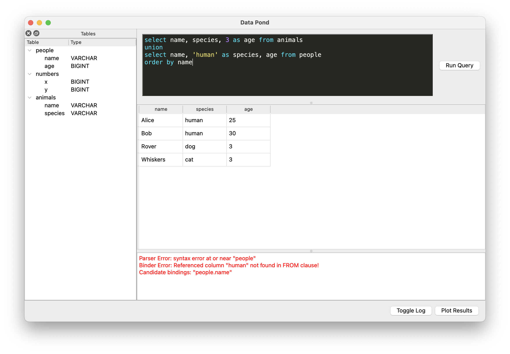

# Data Pond

Sometimes you don't have a lake, but a little pond of data sitting
around in your computer and you would like to explore it.

Data Pond is a little app for just that:
- Import a folder full of CSV files
- Turns each of them into an in-memory table (powered by Duckdb) and
  show them on a sidebar with their columns and inferred data types
- Let you run SQL queries over them, including creating new tables
  that will show up in the sidebar
- Simple plotting of results

This is more of a toy application, that I made as way to practice the
approach described in the
[GOOS](http://www.growing-object-oriented-software.com) book, but I
still find it neat and have used it ocasionally. I see it as just a
bit less bureaucratic than firing up a Jupyter notebook and fiddling
with data there, that I would rather open it to look at some files.

## How to

To run it or develop it you need:

- Python 3.12* 
- make

*present on your PATH as `python3`, or you can redefine the
`SYSTEM_PYTHON` env var to point to your installation before running
`make .venv`

- `make sync` creates a venv under `.venv`, and install dependencies. 
- `make test` runs tests
- `make run` runs the app

I use `uv` as a drop in replacement for pip-tools, but it's installed
automatically in the venv. I will probably switch to pure `uv` soon,
now that the dependency locking mechanism is in place.
